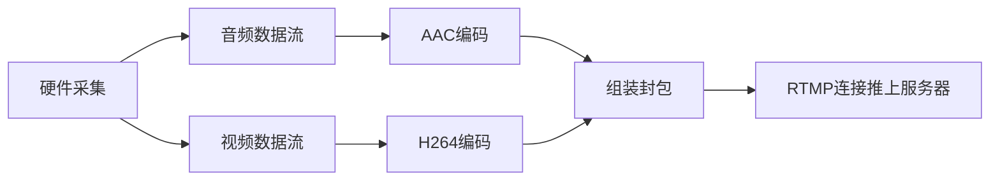
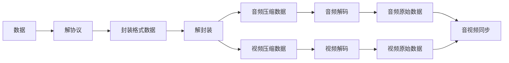

  
# 前言
  
虽然2019年已经不是音视频的风口，但是不可否认在iOS开发中，依旧属于一个很火的领域，由于一直没有机会进入到一间由音视频技术驱动的公司，所以对音视频这块的学习没有很深入的学习，上年年底的时候，决心要做出点改变，所以有了这篇。  
原来这篇只是作为一个自己的学习笔记，并没有打算作为文章发出来，后来大体将音视频最基础的点都记录后，想到作为一个入门小白级的文章，或许是个不错的选择。不过也因为最初的原因，参考了不少网上前辈的文章，但是没有记录下参考链接，如果有发现相似的内容，请在评论区下留下链接，定会在文末补上参考链接。  
  
  
  
# 直播
  
  
[视频直播中说的抓流和推流，是什么意思，两种有什么区别？ - 刘博的回答 - 知乎](https://www.zhihu.com/question/26038990/answer/130557483)  

推流，指的是把采集阶段封包好的内容传输到服务器的过程。  
拉流是指服务器已有直播内容，用指定地址进行拉取的过程。  

介绍一下目前有主流的推送协议，以及各自的优缺点。  
1. RTMP  
RTMP协议中，视频必须是H264编码，音频必须是AAC或MP3编码，且多以flv格式封包。RTMP是目前最主流的流媒体传输协议，对CDN支持良好，实现难度较低，是大多数的直播平台的选择。  
不过RTMP有着一个最大的不足——不支持浏览器，且Adobe已不再更新。因此直播服务要支持浏览器的话，需要另外的推送协议支持。
  
2. HLS  
Http Live Streaming是由Apple公司定义的基于HTTP的流媒体实时传输协议。它的原理是将整个流分为多个小的文件来下载，每次只下载若干个。服务器端会将最新的直播数据生成新的小文件，客户端只要不停的按顺序播放从服务器获取到的文件，就实现了直播。基本上，HLS是以点播的技术实现了直播的体验。因为每个小文件的时长很短，客户端可以很快地切换码率，以适应不同带宽条件下的播放。  
分段推送的技术特点，决定了HLS的延迟一般会高于普通的流媒体直播协议。  
传输内容包括两部分：一是M3U8描述文件，二是TS媒体文件。TS媒体文件中的视频必须是H264编码，音频必须是AAC或MP3编码。  
由于数据通过HTTP协议传输，所以完全不用考虑防火墙或者代理的问题，而且分段文件的时长很短。  
3. WebRTC  
WebRTC（Web Real-Time Communication），即“源自网页即时通信”。WebRTC是一个支持浏览器进行实时语音、视频对话的开源协议。WebRTC的支持者甚多，Google、Mozilla、Opera推动其成为W3C推荐标准。WebRTC支持目前的主流浏览器，并且基于SRTP和UDP，即便在网络信号一般的情况下也具备较好的稳定性。此外，WebRTC可以实现点对点通信，通信双方延时低，是实现“连麦”功能比较好的选择。
  
# RTMP和HLS对比
  
· RTMP 首先就是延迟低，基于TCP的长链接，对于数据处理及时，收到即刻发送，推荐使用场景：即时互动。  
· HLS 延迟高，短链接，原理是集合了一段时间的视频数据，切割ts片，逐个下载播放。优点是跨平台。
  
# 编码和解码
  
> 为什么要编码和解码？   
  
先上数据：  
一张1280 * 720 的RGBA图像大小等于：1280 * 720 * 4 = 3.516MB  
一张1280 * 720 的YUV图像大小等于：1280 * 720 * 1 + 1280 *720 * 0.5 = 1.318MB  
假设fps为24，一般电影长度90分钟大小等于： 1.318MB * 24fps * 90min * 60s = 166.8GB  
这么大是不行的，所以需要视频编码。 
  
采集的原始音视频信号体积都非常大。里面有很多相同的、眼看不到的、耳听不到的内容。为了减小体积便于存储、传输、交流，就有了压缩无用信息和不重要的信息的“压缩处理”，这就叫“编码”。  
压缩（编码）过的内容无法直接使用，使用（观看）时必须解压缩，还原为原始的信号（比如视频中某个点的颜色等），这就是“解码“或者”解压缩“
  
  
软编解码：使用CPU进行编解码，大多使用FFmpeg来编码和解压音视频数据；  
硬编解码：主要使用非CPU进行编解码，如GPU等。在使用中，大多直接调用系统API进行音视频编解码处理。使用VideoToolbox中的VTCompressionSessionRef实现   
  
# CMSampleBufferRef
  
系统的音视频输出类会回调`CMSampleBufferRef`，我们可以通过这个获取视频帧或者音频帧。  
代表视频的CMSampleBufferRef中保存的数据是yuv420格式的视频帧。（可以在设备输出初始化修改格式）  
代表音频的CMSampleBufferRef中保存的数据是PCM格式的音频帧。  
yuv是一种图片储存格式，跟RGB格式类似。yuv中，y表示亮度，单独只有y数据就可以形成一张图片，只不过这张图片是灰色的。u和v表示色差(u和v也被称为：Cb－蓝色差，Cr－红色差)  
  
  
# FLV
  
flv是一种简单的视频合成格式。它支持指定的音视频格式，如：h263，h264，VP6 及 AAC，MP3，Nellymoser等。    
flv刚好支持 h264 和 aac。  
rtmp协议所传输的视频流，就要求是flv格式。


# 视频数据采集原理(推流)
1. 音视频的采集，iOS 中，利用 AVCaptureSession和AVCaptureDevice 可以采集到原始的音视频数据流。一般采集原始格式为YUV，因为前面也有提到了，YUV体积比较小。  
```objc

- (AVCaptureSession *)session
{
    if (!_session) {
        // 1. 创建`AVCaptureSession`用来管理音视频输入、输出，`setSessionPreset:`可以设置视频分辨率；
        _session = [AVCaptureSession new];
        [_session setSessionPreset:AVCaptureSessionPreset640x480];
    }
    return _session;
}

- (void)setupVideoCapture
{
    //  2. 通过`AVCaptureDevice`拿到物理设备，再初始化`AVCaptureDeviceInput`输出对象；
    AVCaptureDevice *device = [AVCaptureDevice defaultDeviceWithMediaType:AVMediaTypeVideo];
    NSError *error = nil;
    AVCaptureDeviceInput *deviceInput = [AVCaptureDeviceInput deviceInputWithDevice:device error:&error];
    // 3. 将其设备输出对象`AVCaptureDeviceInput`添加到`AVCaptureSession`的输入中
    if ([self.session canAddInput:deviceInput])
    {
        [self.session addInput:deviceInput];
    }
    // 4. 创建输出对象
    AVCaptureVideoDataOutput *videoDataOutput = [AVCaptureVideoDataOutput new];
    // 5. 设置输出格式，iOS下目前仅支持这3种
    /*
     kCVPixelFormatType_420YpCbCr8BiPlanarVideoRange YUV格式，Y值取值范围[16,235]
     kCVPixelFormatType_420YpCbCr8BiPlanarFullRange  YUV格式，Y值取值范围[0,255]
     kCVPixelFormatType_32BGRA                       BGBA格式
     */
    NSDictionary *rgbOutputSettings = @{(NSString *)kCVPixelBufferPixelFormatTypeKey:@(kCVPixelFormatType_32BGRA)};
    [videoDataOutput setVideoSettings:rgbOutputSettings];
    // 6. 放弃因为阻塞而延迟的视频帧
    [videoDataOutput setAlwaysDiscardsLateVideoFrames:YES];
    // 7. 创建一个串行队列，保证输出帧是按顺序返回的
    dispatch_queue_t videoDataOutputQueue = dispatch_queue_create("VideoDataOutputQueue", DISPATCH_QUEUE_SERIAL);
    [videoDataOutput setSampleBufferDelegate:self queue:videoDataOutputQueue];
    
    if ([self.session canAddOutput:videoDataOutput]) {
        [self.session addOutput:videoDataOutput];
    }
    self.videoConnection = [videoDataOutput connectionWithMediaType:AVMediaTypeVideo];
}

```


2. 对视频进行 H264 编码，对音频进行 AAC 编码，在 ios 中分别有已经封装好的编码库来实现对音视频的编码。  
  
3. 对编码后的音、视频数据进行组装封包；  
  
4. 建立 RTMP 连接并上推到服务端。  

  


  
# 视频播放原理(拉流)
  
    

  
解封装的作用，就是将输入的封装格式的数据，分离成为音频流压缩编码数据和视频流压缩编码数据。封装格式种类很多，例如MP4，MKV，RMVB，TS，FLV，AVI等等，它的作用就是将已经压缩编码的视频数据和音频数据按照一定的格式放到一起。例如，FLV格式的数据，经过解封装操作后，输出H.264编码的视频码流和AAC编码的音频码流。  
  
解码的作用，就是将视频/音频压缩编码数据，解码成为非压缩的视频/音频原始数据。音频的压缩编码标准包含AAC，MP3，AC-3等等，视频的压缩编码标准则包含H.264，MPEG2，VC-1等等。解码是整个系统中最重要也是最复杂的一个环节。通过解码，压缩编码的视频数据输出成为非压缩的颜色数据，例如YUV420P，RGB等等；压缩编码的音频数据输出成为非压缩的音频抽样数据，例如PCM数据。
视音频同步的作用，就是根据解封装模块处理过程中获取到的参数信息，同步解码出来的视频和音频数据，并将视频音频数据送至系统的显卡和声卡播放出来。  
  
为什么要分封装格式和视频编码格式呢？ 这个其实跟网络分七层模型一个原理。解耦和，降低依赖，底层给上层提供基础功能，底层和上层都都可以单独扩展，可以以多种方案组合编码与封装，比如MP4与H264、MP4与MPEG、TS与H264等等。比如这里面的这边文章的编码就只负责将最原始的音频和视频数据就行压缩，而压缩完的数据要怎么组织就拜托给上层的封装，封装接到视频音频数据负责给数据编号，指定同步协议，加入字幕等操作。经过封装后，得到的就是可以播放的上面提到的视频文件MP4或者MKV等等。把这个过程反过来就是上图描述的视频播放的过程。
  
  
# 优化
  
## 播放卡顿
  
> 造成卡顿的原因有几种情况  
1. 推流端网络抖动导致数据无法发送到服务器，造成播放端卡顿;
2. 播放端网络抖动导致数据累积在服务器上拉不下来，造成播放卡顿。  
  
## 弹幕优化
  
1. 弹幕阴影通过`NSAttributeString`的`NSStrokeColorAttributeName`属性设置文字的轮廓颜色替换文字阴影。  
2. 用CALayer替代UIView展示。  
3. 将内容合成一张图片展现。  
  
## 优化切换前后台带来的累积延时
  
- 第一种方案是播放器采用视频同步音频的策略，然后退到后台时保持音频继续播放（在 iOS 平台需要开启 App 的 Background Audio 能力来配合）。这样可以保持音频一直播放不产生延时，而当回到前台时，视频同步音频直接切换到最新时间戳即可。笔者发现斗鱼也是使用了这个机制。  
- 第二种方案是回到前台时重新刷新直播，重连直播流，这样即可消灭累积延时。但是这种方案的问题是重连直播流的过程需要一定的时间，这样回到前台时会有卡顿，或者出现黑屏，尤其是当你的首屏加载优化不够时，这个卡顿或黑屏时间会较长。所以这种方案在你的首屏加载优化的比较好的情况下可以采用。此外，你可以退到后台时截取视频当前帧贴图到直播间上，从而当切回前台时，防止黑屏，优化体验，实践效果还是不错的。  
  
  
  
## 音视频同步
  
[参考](https://techblog.toutiao.com/2018/05/29/untitled-20/ )
  